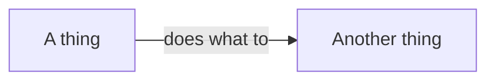

# Page template

Copy the shape, not the words. Delete a section that has nothing to say rather than
padding it.

```markdown
---
layout: default
title: <A noun or a question. "Data types", "What is a secret">
summary: <One sentence saying what the page covers. Not a slogan.>
tier: Foundations
slug: <file name without the extension>
order: <position in the tier>
requires: [<slugs the reader must have read>]
---

<The definition. One or two sentences. The first line on the page, with no preamble
before it.>

<One sentence on what the AI does here and what it cannot decide. This is why the
page exists.>

<Optional. Include a rules block only where a wrong move loses data, leaks a secret,
costs money, or cannot be undone. Delete this block on a page that has no such move.>

{: .rules}
- **NEVER** <the irreversible thing>.
- **ALWAYS** <the thing skipping which causes harm>.

## The problem

<The concrete failure this prevents. Name what breaks, for whom, and what it costs.
A reader who has met this failure should recognise it.>

## Mental model

<One picture the reader can hold. A diagram belongs here when the idea has a shape.>



<One line after the diagram saying what to notice. The surrounding text carries the
fact as well, because a diagram never carries one alone.>

## <The parts>

<One short block per named concept. Use the concept as the heading.>

## What this means in your language

<Only when the languages genuinely differ in a way that changes what the reader does.
All five or none. See STYLE.md.>

## What you decide

| Decision | Why it is yours |
|---|---|
| <the judgment> | <what only the reader knows> |

## Common mistakes

- **<The mistake in bold.>** <What happens, and the correct move.>

## Next

- [<Page>]({{ '/foundations/<slug>' | relative_url }}) — <why to read it next>
```

## Rules block wording

Each rule is imperative, 15 words or fewer, and names one action.

Good:

- `**NEVER** commit a secret, or place one in code the browser downloads.`
- `**ALWAYS** treat a leaked secret as used, and replace it.`

Not rules:

- `**NEVER** write unclear variable names.` — a style preference, not a consequence.
- `**ALWAYS** think about performance.` — no action, so nothing to obey.

## Diagram shapes that work

| The idea | The shape |
|---|---|
| Two sides with a boundary between them | `flowchart LR` with a subgraph each side |
| A chain of states over time | `flowchart LR`, one node per state |
| A decision with two answers | `flowchart TD` with a diamond |
| Branching and rejoining | `gitGraph` |
| The same input treated two ways | two parallel rows, so the contrast is visible |
