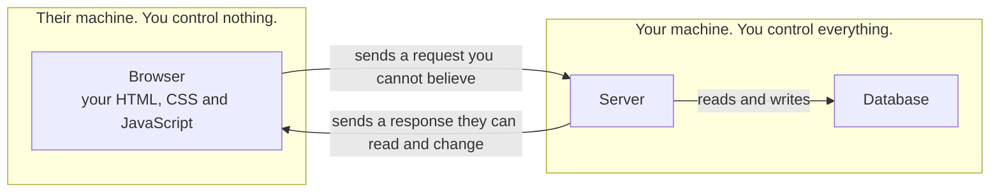
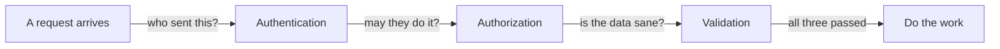

The client is your code running on someone else's machine. The server is your code
running on a machine you control. The line between them decides what stays secret and
what you may believe.

Your AI writes code for both sides on request. It cannot decide which side a piece of
logic belongs on, because that is a judgment about who you trust.

{: .rules}
- **NEVER** put a secret in code the browser downloads.
- **NEVER** trust a value because it arrived from your own front end.
- **NEVER** let the client choose a price, a role, or a user id.
- **ALWAYS** check permission on the server, on every request.
- **ALWAYS** treat client-side validation as help for the user, not as protection.

## The problem

Four failures, all the same mistake:

- The browser sends the price. A customer pays 1 pence for a 400 pound item.
- The front end hides the admin button. A customer changes one value in the developer
  tools and the button returns.
- The page holds an API key. A stranger reads it and spends your credit.
- The form checks the email address. A script sends a request with no form at all.

Each one trusted something on the other side of the line.

## Mental model

Two rules follow from the picture, and everything else is detail.

**Anything you send is public.** The user reads your JavaScript, your comments, and
the feature you disabled last week. No amount of minifying changes this.

**Anything you receive is a claim.** A request is a stranger telling you what
happened. It is not evidence, even when your own front end sent it.

## The front end is a suggestion

Your website is not your program. It is a copy of your program that you gave away.
The person holding it can read every line, change any value while it runs, and send
your server any request they like with no browser involved.

So a check that runs only in the browser is not a check. It is a hint.

## Then why validate on the client at all

Both sides validate, for different reasons. This is not duplicated work.

| Side | Purpose | What happens without it |
|---|---|---|
| Client | Tell the user immediately | The form feels slow and rude |
| Server | Protect data, money and other users | Anyone bypasses the rule with one request |

Client validation is a feature. Server validation is the rule. Removing the client
check costs you a worse experience. Removing the server check costs you the company.

## Every request starts again

The server forgets you between requests. Each one arrives alone, from a stranger, and
must prove itself again.

All four steps run on the server, on every request. A check performed when the page
loaded protects nothing, because the next request does not remember it.

Authentication asks who someone is. Authorization asks what they may do. Passing the
first grants nothing about the second.

## The line runs through your codebase

In a modern framework both sides live in one repository, often in one folder, and
sometimes in one file. The framework decides what crosses, and the markers are easy
to miss:

- A `NEXT_PUBLIC_` prefix publishes the value to the browser. The prefix is the whole
  decision.
- A `"use client"` directive moves that file to the browser.
- **Anything a client file imports becomes client code.** A server utility imported
  into a client component travels with it, and the secret inside travels too.

The third one causes real leaks, because nothing in the code looks wrong. The import
line is the mistake.

## The two questions

Ask both about any piece of logic before you place it:

1. **If the user changed this, what happens?** A bad answer means it runs on the server.
2. **If the user read this, what leaks?** A bad answer means it never reaches the browser.

## What you decide

| Decision | Why it is yours |
|---|---|
| Which side each piece of logic runs on | Only you know the cost of the user changing it |
| What is allowed to cross to the browser | Your AI ships whatever your code imports |
| Which requests need a permission check | The framework does not know your rules |
| Whether a check is for comfort or for safety | The same code serves two different purposes |

## Common mistakes

- **Taking the price, the total, or the discount from the request.** Read them from
  your own database.
- **Reading the user id or the role from the request body.** Read them from the session.
- **Hiding a control instead of refusing the action.** Hidden is not forbidden.
- **Calling a paid service from the browser with your key.** Your server makes that
  call, and the browser asks your server.
- **Believing CORS protects your API.** CORS stops other websites from using a
  visitor's browser against you. It stops nothing sent directly to your server.
- **Believing an API is private because only your app calls it.** Anyone who opens
  the network tab now knows every address.

## Next

- [What is a secret]({{ '/foundations/what-is-a-secret' | relative_url }}) — which values must never cross the line
- Authentication and authorization
- What is an API
