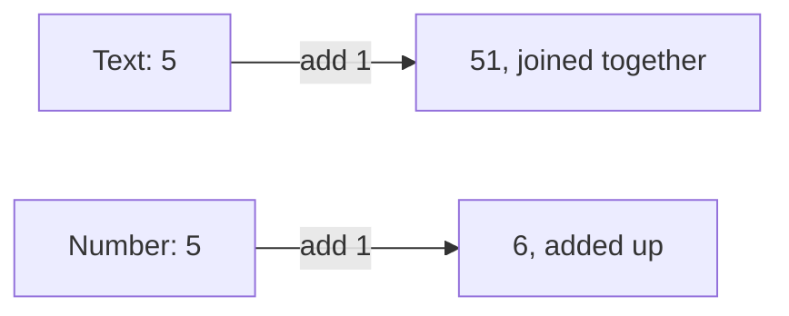

A data type is the kind of a value. Text, a whole number, a decimal, true or false, a
date, a list. The kind decides what the computer does when you use the value.

Two values can look identical on screen and behave completely differently. This is
the source of a whole family of bugs that produce no error message at all.

{: .rules}
- **NEVER** store money as a decimal fraction. Store whole pence or cents.
- **NEVER** store a date without knowing its time zone. Store UTC.
- **NEVER** treat a phone number, postcode or reference as a number.
- **ALWAYS** convert text to a number before doing arithmetic with it.
- **ALWAYS** decide what an empty value means before you allow one.

## The problem

Nothing here raises an error. Each one gives a wrong answer and continues.

```text
"5" + 1          becomes "51"
0.1 + 0.2        becomes 0.30000000000000004
"07700 900123"   becomes 7700900123
Boolean("false") becomes true
```

The last one is worth reading twice. The text `false` is not the value false. Any text
that is not empty counts as true.

## Mental model

The same characters carry a different kind, and the kind decides the behaviour.



Everything arriving from outside your program is text. A web form sends text. A web
address holds text. A file holds text. Something must convert that text into the kind
you meant, and if you do not choose where, the language chooses for you.

## The kinds you meet

| Kind | Holds | Use it for | Never use it for |
|---|---|---|---|
| Text | Characters | Names, addresses, phone numbers, postcodes, ids | Arithmetic |
| Whole number | Counts with no fraction | Quantities, money in pence, positions | Anything needing a half |
| Decimal | Fractions, approximately | Measurements, averages, percentages | Money |
| True or false | One of two states | A setting that is on or off | Anything with a third state |
| Date and time | One instant | When something happened | A duration, or a birthday |
| List | Many values in order | Search results, line items | One value |
| Nothing | The absence of a value | Recording that you do not know | A zero, or an empty answer |

## Money

A decimal cannot hold most fractions exactly. It holds the nearest value it can, and
the error is small. Add a thousand of those errors and the total no longer matches the
sum of its parts. Your accounts disagree by a penny and nobody can find why.

Store money as a whole number of the smallest unit. £12.34 is stored as `1234`. Divide
by 100 only when you show it to a person.

This is not a preference. Currency and rounding rules are legal requirements in many
places, and a decimal fraction cannot satisfy them.

## Dates and time zones

A date with no time zone is not an instant. It is an instant in a place, and you were
not told the place.

Store every moment in UTC, which is one worldwide clock with no daylight saving.
Convert to the reader's local time when you show it. If you store local time, then
twice a year one hour happens twice or never, and your ordering breaks.

A birthday is different. It has no time and no time zone, because it is the same day
everywhere. Store it as a plain date, not as an instant.

## The several kinds of nothing

"No value" is not one thing, and the differences matter.

| Value | Means |
|---|---|
| Missing | Nobody was ever asked |
| Empty text | Someone was asked and typed nothing |
| Null | Known to have no value |
| Zero | A real measured amount, which happens to be none |
| False | A real answer, which happens to be no |

A customer with zero orders and a customer whose order count was never counted are
different customers. Storing both as `0` throws that difference away permanently.

Decide which of these your field allows, and refuse the rest.

## Text that looks like a number

A postcode, a phone number, a bank sort code and most ids are text that happens to
contain digits.

Store any of them as a number and the leading zero disappears. `07700` becomes `7700`.
The value is now wrong and nothing warned you. The test is simple. If adding one to it
is meaningless, it is text.

## What types checking does and does not do

A type checker such as TypeScript reads your code before it runs and complains when
the kinds do not match. This catches a large class of mistakes early.

It checks nothing while the program runs. Data arriving from a browser, a file or
another company's service is whatever actually arrived. A declaration that it should
be a number is a note to you, not a guard. Check the real value when it arrives.

## What this means in your language

Everything above is true everywhere. How much the language helps you varies enormously,
and the differences decide how much care each rule needs.

<div class="languages" markdown="1">

<details markdown="1">
<summary>JavaScript and TypeScript</summary>

- **One number type, and it is a decimal.** There is no whole number type. Every
  number is the kind that cannot hold fractions exactly, so `0.1 + 0.2` is wrong here.
  Hold money as a whole number of pence and never divide until you display it.
- **Two kinds of nothing.** `null` means set to nothing. `undefined` means never set.
  They behave differently and both appear in real data.
- **Values change kind on their own.** `"5" + 1` joins text. `"5" - 1` does arithmetic.
  Compare with `===`, which does not convert, rather than `==`, which does.
- **TypeScript disappears when the program runs.** Its checks are removed before the
  code executes. A value arriving from a form or another service is whatever actually
  arrived, so check it with a runtime validator such as Zod.
- **Dates are weak.** The built-in date is an instant with awkward time zone handling.
  Use a dedicated library, and store UTC.

</details>

<details markdown="1">
<summary>Python</summary>

- **Whole numbers are unlimited.** They never overflow, so counting is safe.
- **`float` is the inexact decimal.** For money use the `Decimal` type from the
  standard library, or whole pence as an `int`.
- **One kind of nothing.** `None`, which is simpler than most languages.
- **Type hints are not enforced.** The program runs whatever it is given. Use Pydantic
  when data arrives from outside.
- **Aware and naive datetimes.** A `datetime` with no time zone attached is the classic
  bug here. Always attach UTC.

</details>

<details markdown="1">
<summary>C#</summary>

- **`decimal` is genuinely exact for money.** Unlike most languages, C# has a base ten
  decimal type built for currency. Use `decimal` for money and `double` for
  measurements. Never the other way round.
- **Kinds are checked before the program runs**, so many of the mistakes above are
  caught at compile time.
- **Nothing has a warning system.** Nullable reference types make the compiler tell you
  where a value might be missing. Switch them on.
- **`DateTimeOffset`, not `DateTime`.** A plain `DateTime` can forget which zone it
  belongs to. `DateTimeOffset` carries it.

</details>

<details markdown="1">
<summary>Java</summary>

- **`BigDecimal` for money.** `double` and `float` are the inexact kinds. Whole pence
  in a `long` also works and is faster.
- **Whole numbers do overflow.** An `int` stops at about 2.1 billion and wraps around
  to a negative number with no error. Use `long` for anything that counts upward.
- **`null` and the exception it causes** are the most common failure. `Optional` makes
  a missing value visible in the signature.
- **Use `java.time`.** The older `Date` and `Calendar` classes are error prone. `Instant`
  and `ZonedDateTime` replace them.

</details>

<details markdown="1">
<summary>PHP</summary>

- **Values convert themselves aggressively.** Comparison with `==` converts before
  comparing and produces surprising results. Always use `===`.
- **Turn on strict types.** `declare(strict_types=1)` at the top of each file stops
  silent conversion at function boundaries.
- **No exact decimal type.** Use whole pence in an integer, or the BCMath extension.
  Never a plain float for money.
- **`DateTimeImmutable`, not `DateTime`.** The mutable one is changed by the code you
  pass it to, which causes bugs far from the cause.

</details>

</div>

## What you decide

| Decision | Why it is yours |
|---|---|
| Which kind each piece of information is | Only you know whether adding one is meaningful |
| What an empty value means for this field | The database cannot tell absent from zero |
| Where text becomes a number | Leave it unchosen and it happens somewhere surprising |
| Which unit a number is in | `1234` is meaningless until you say pence |

## Common mistakes

- **Doing arithmetic on values from a form.** They are text until you convert them.
- **Storing prices as decimals.** Use whole pence.
- **Storing local time.** Store UTC and convert when displaying.
- **Allowing null everywhere by default.** Every later line must then handle it.
- **Trusting a declared type for outside data.** The declaration checks your code, not the world.

## Next

- [Ids]({{ '/foundations/ids' | relative_url }}) — why an id is text, not a number
- [Client and server]({{ '/foundations/client-and-server' | relative_url }}) — why outside data is never what it claims
- Databases and tables
