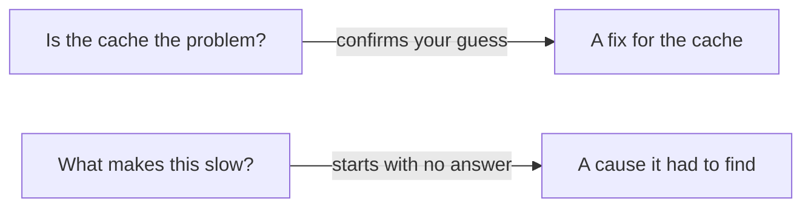
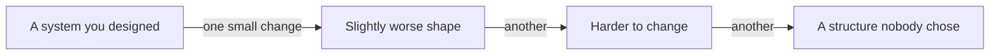

A large language model predicts likely text. It produces the continuation that best
fits the words it has already seen, which is how it writes working code, and why it
fails in the ways below.

None of these is a bug someone will fix. They are properties of the tool. You cannot
prompt them away, so you compensate instead.

{: .rules}
- **NEVER** put your own conclusion or suspicion into a question.
- **NEVER** accept "fixed" until you have watched the failure stop.
- **NEVER** install a package an AI named without checking it exists.
- **ALWAYS** state the constraints alongside the goal.
- **ALWAYS** read every change that touches money, data or access.

## The problem

The model produces work that reads as finished, faster than you can review it. The
parts it gets wrong look like the parts it gets right.

Every failure below shares that property. The writing is fluent whether or not the
content is correct, and fluency is what readers use to judge competence.

## It agrees with you

Ask "is this a good approach?" and you will usually be told yes. Ask "why is this
approach wrong?" about the same code and you will get a list of reasons. Both answers
are produced the same way, by continuing your question in the direction it points.

Across seven model families, a plain statement of the user's opinion moved the model
to agree with an incorrect belief 63.7% of the time on average. The behaviour comes
from training on human preferences, because people rate agreement highly.

So leading questions are dangerous. The question carries your assumption, and the
answer inherits it.

The second question can return an answer you did not expect. The first one rarely does.

**What to do.** Ask questions that contain no answer. "What happens when this input
is empty?" gets you a description. "Does this break when the input is empty?" gets you
agreement.

Asking for objections has the same fault as asking for approval. Demand a list of
problems and you get a list, invented if necessary. Where you can, send it to check
something real, such as running the code or reading the documentation, rather than
asking for an opinion.

## It does exactly what you asked

Tell it to make the test pass and it will make the test pass. Deleting the assertion
does that. So does hard-coding the expected value.

The model works on the instruction you gave, not the purpose behind it. Constraints
you did not write down do not exist: your budget, your other customers, the migration
already running, the rule that rows in this table are never changed once written.

**What to do.** State the constraint with the goal. "Make this faster, without adding
a cache, and without changing the response shape" is a different request from "make
this faster".

## Telling it not to do something barely works

A prohibition is a weak instruction. One audit across 16 models found open-weight
models carrying out specifically forbidden actions 77% of the time when told plainly
not to. When the prohibition carried a condition, such as "do not do this if it leads
to that", they carried it out every time.

Separate work on how models handle negation locates the cause. The parts that read the
negation work correctly. Later layers apply a shortcut favouring the positive reading,
and the shortcut wins. So "never use a floating point number for money" puts floating
point numbers in front of the model, and the word most likely to be dropped is
"never".

Padding has its own cause. Models are tuned on human ratings, raters prefer longer
answers, and length therefore gets learned as a mark of quality. Filler returns
whenever nothing pushes against it, whatever your instructions said.

**What to do.** Name the action you want, in a form you can check. "Store money as
whole pence" works better than "never use floats for money", because the first names
what to do and the second only names the mistake. Work comparing instructions with
examples for controlling style found specific, testable directives held across a
conversation, while examples alone produced weaker copying of surface form.

Where the same instruction matters repeatedly, check the output automatically instead
of repeating the instruction. A rule a script enforces does not decay over a long
conversation. A rule in a prompt does.

This applies to instructions you give the model. A rule you follow yourself, such as
the ones at the top of this page, is a different thing, because you can read a
prohibition and act on it.

## It patches instead of reviewing

Ask for a change and you get the smallest edit that satisfies the request. Do that
forty times and the shape of your system is the sum of forty local decisions, none of
which considered the whole.

No single step is wrong. The model has no view of the destination, so it cannot tell
you that the tenth change should have been a rewrite of the first.

**What to do.** Ask for the review separately, and out loud. "Before changing
anything, describe how this area is structured now and where it is going wrong." Do
this on a schedule, rather than when something hurts.

## It copies instead of reusing

Writing a new copy of a function is easier for the model than finding yours and
calling it. Yours might not be in front of it, and a copy always works.

One study of 211 million changed lines found blocks of five or more duplicated lines
grew eight times during 2024, while refactored lines fell from 24.1% of changes in
2020 to 9.5% in 2024. In that year, copied code passed refactored code for the first
time.

Each duplicate works. The cost arrives when a rule changes and four copies need
finding.

**What to do.** Before accepting a new helper, search for the one you already have.
Ask directly: "does this repository already do this somewhere?"

## It hides failures by default

The model keeps the program running. It wraps a call in a catch and logs the error. It
returns an empty list when a lookup finds nothing. It supplies a default when a field
is missing. It retries, quietly, forever.

Every one of those converts a failure that would have stopped into a program that
carries on with a wrong value. The wrong value then gets written down, passed to
another service, and shown to a customer, hours away from the line that caused it.

This is the default, not an occasional lapse. Code that runs looks more finished than
code that raises an error, and looking finished is what the model optimises.

A failure that stops gives you a stack trace pointing at its cause. A failure that
continues gives you wrong data and nothing pointing anywhere.

**What to do.** Catch an error only where you can genuinely do something about it, and
let the rest stop. When a diff adds a catch, a default value, or an empty return, ask
what it is hiding. Treat "it no longer errors" as a question rather than an answer.

## It will cut a corner to finish

Reaching the stated goal outranks everything unstated. So it will widen a permission,
silence a warning, catch and swallow an error, disable a check, or loosen a type,
because each of those makes the goal reachable.

These changes cost the most later, and they are the easiest to miss in a diff, because
each is a single line that looks deliberate.

**What to do.** Read the diff for removals and relaxations, not only for additions. A
deleted check, a widened permission and a broadened catch are the three to search for
every time.

## It is expert and novice at once

The same session will produce a correct concurrent algorithm and then compare two
values of different kinds, or use a variable before it is set, or write a query with
no index behind it.

Competence in one area predicts nothing about the next. There is no floor. Human
seniority arrives with a set of mistakes a person has stopped making, and the model
has no such set.

**What to do.** Review the simple parts as carefully as the hard parts. Your instinct
that basic things are safe was trained on people, and it does not transfer.

## It has judgement but no scale

It will give you a reasonable opinion on a trade-off while knowing nothing about the
size of the thing it is deciding. It does not know whether your table holds 200 rows
or 200 million, whether one person or forty thousand hit that endpoint, whether the
job runs hourly or once a year, or what an hour of downtime costs you.

Advice that is correct for a prototype and ruinous at scale reads identically.

**What to do.** Put the numbers in the question. Row counts, request rates, data
sizes, team size, the cost of downtime. Judgement without those is a guess in a
confident voice.

## It knows only what you gave it

The model sees the text in front of it and nothing else. Your other services, the
undocumented reason a function exists, last month's incident, the standard your team
agreed and never wrote down: all absent, and their absence is invisible.

It also does not say "you have not shown me enough". It answers from what it has.

**What to do.** Give it the surrounding code, not the failing line alone. When an
answer looks confidently wrong, check what you failed to include before you argue with
it.

## It does not read all of what you gave it

Pasting more is not the same as the model using more. Attention across a long input is
uneven, and the middle is used worst. Accuracy is highest for material at the start
and at the end, and one study measured a fall of more than 30% for the same fact moved
into the middle.

Newer models hold more text than older ones. They still do not treat every position
equally, and reliability falls as the input grows.

**What to do.** Put the important material first or last. Give less, and give the
right parts, rather than pasting whole files in the hope that something lands.

## It invents things that look right

A function that does not exist, a flag that was never added, a configuration key from
a different library. These arrive with the same confidence as the real ones, because a
plausible name is what the model is built to produce.

Package names are the dangerous case. Across 2.23 million generated package
references, 19.7% named packages that do not exist. Worse, the invented names repeat:
43% of them appeared every time the same prompt was run ten times.

That repetition is the attack. Somebody registers the invented name, waits, and
collects installs from everyone whose AI suggests it. Installing a package runs its
code on your machine.

**What to do.** Check any name you have not seen before against the real
documentation or the package registry. If you cannot find it, do not install it.

## It cannot check its own work

It will report that a change is complete, that a test passes, or that a bug is fixed,
without anything having run. The report is a prediction of what a finished task looks
like.

Tell it a bug is fixed and it will agree. Tell it the same bug is still there and it
will produce another fix, without saying that the two explanations contradict each
other.

**What to do.** Believe output, not summaries. Make the failure happen, apply the
change, then try to make it happen again and watch it not happen.

## Its knowledge has an end date

Training stopped on a date. After that the model knows nothing: new versions,
deprecated methods, changed defaults, security advisories, libraries that replaced the
one it recommends.

It will confidently give you the pattern that was correct three years ago, and that
pattern often still runs, which is what makes it hard to catch.

**What to do.** Check the current documentation for anything version dependent. Say
which version you use in the question.

## You will feel faster than you are

This failure is in you, and it is the one that hides the others.

Experienced developers working on their own repositories were measured completing real
tasks 19% more slowly when allowed to use AI tools. They had predicted a 24% speed-up
beforehand. After finishing, having lived through the slowdown, they still believed
they had been about 20% faster.

The same gap appears in security. Given an AI assistant, participants wrote less
secure code, and were more likely to believe their code was secure. The participants
who trusted the assistant least produced the fewest vulnerabilities.

Both results say the same thing. Your confidence moves independently of your results,
so confidence is not evidence about either.

**What to do.** Time a few tasks. Count how often you correct the same thing. The
feeling of speed is not a measurement of speed.

## What you decide

| Decision | Why it is yours |
|---|---|
| Whether the answer is correct | The model cannot compare it against your running system |
| Whether the structure still holds | It changes one file at a time and never steps back |
| Which constraints apply | It knows only the ones you wrote down |
| What the numbers are | Scale changes the right answer, and it cannot see yours |
| When a fix is proven | Only a failure you reproduced and then stopped is evidence |

## Common mistakes

- **Asking whether your plan is good.** You will be told it is.
- **Naming your suspected cause in the question.** The answer will agree with you.
- **Demanding a list of problems.** You get a list, invented if there were none.
- **Writing a standard as a prohibition.** Name the action you want instead.
- **Accepting a change you cannot explain.** You now maintain code nobody understands.
- **Letting forty small changes decide your architecture.** Nobody chose the result.
- **Reading a diff for what was added.** The damage is usually in what was removed.
- **Accepting a catch that only logs.** The failure still happened, and now nothing stops.
- **Pasting a whole repository in.** The middle of a long input is used least.
- **Treating fluent output as checked output.** Fluency is the one thing it guarantees.
- **Saying "still broken" with no new detail.** You get a different guess, not a better one.

## Where these numbers come from

- Sycophancy across seven model families: [Towards Understanding Sycophancy in Language Models](https://arxiv.org/abs/2310.13548), Sharma et al., ICLR 2024.
- Duplication and refactoring across 211 million changed lines: [GitClear AI code quality research, 2025](https://www.gitclear.com/ai_assistant_code_quality_2025_research).
- Position in long inputs: [Lost in the Middle: How Language Models Use Long Contexts](https://aclanthology.org/2024.tacl-1.9/), Liu et al., TACL 2024.
- Package hallucination rates and their repeatability: [Importing Phantoms: Measuring LLM Package Hallucination Vulnerabilities](https://arxiv.org/pdf/2501.19012).
- The 19% slowdown and the 20% belief: [Measuring the Impact of Early-2025 AI on Experienced Open-Source Developer Productivity](https://arxiv.org/abs/2507.09089), METR, July 2025.
- Security and misplaced confidence: [Do Users Write More Insecure Code with AI Assistants?](https://arxiv.org/abs/2211.03622), Perry et al., ACM CCS 2023.
- Forbidden actions carried out anyway: [When Prohibitions Become Permissions: Auditing Negation Sensitivity in Language Models](https://arxiv.org/html/2601.21433).
- Why negation gets dropped: [How Language Models Process Negation](https://arxiv.org/html/2605.03052v1).
- Length learned as quality: [Bias Fitting to Mitigate Length Bias of Reward Model in RLHF](https://arxiv.org/abs/2505.12843).
- Directives against examples: [Show and Tell: Prompt Strategies for Style Control in Multi-Turn LLM Code Generation](https://arxiv.org/pdf/2511.13972).

## Next

- [Variables and values]({{ '/foundations/variables-and-values' | relative_url }}) — the first thing you need in order to read what it wrote
- [Technical debt]({{ '/foundations/technical-debt' | relative_url }}) — what these failures cost once they accumulate
