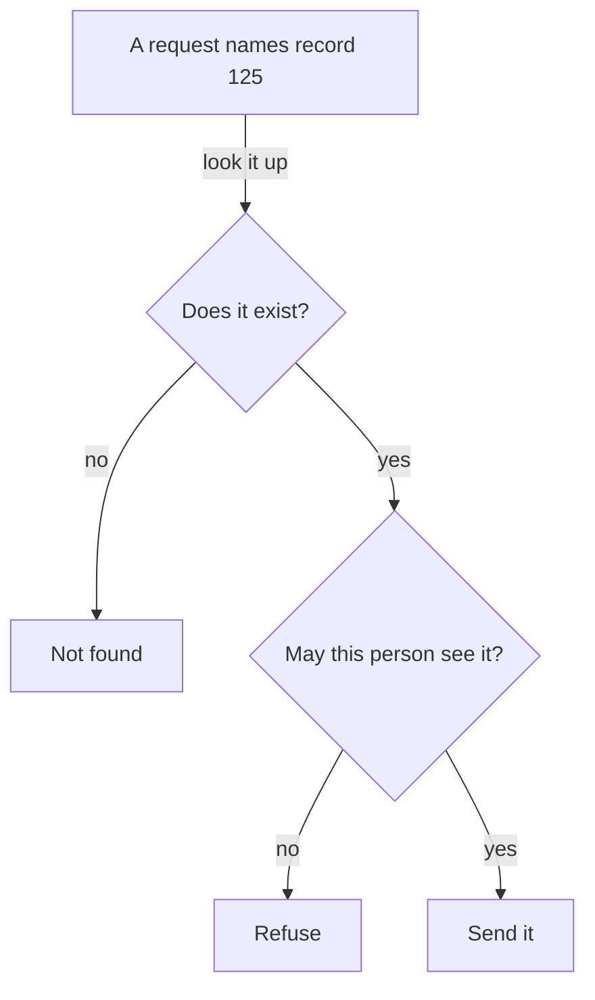

An id is a short value that names one specific thing, such as one customer or one
order. Your database gives almost everything an id, and those ids travel into your
addresses, your emails and other companies' systems.

Your AI will happily write code that looks up a record by the id it was given. Whether
that lookup should have been allowed is your decision.

{: .rules}
- **NEVER** decide who owns a record from an id the client sent.
- **NEVER** treat an id that is hard to guess as a permission.
- **NEVER** use a value people change, such as an email address, as an id.
- **ALWAYS** check the person may see the record, not only that the record exists.
- **ALWAYS** treat any id a customer can see as permanent.

## The problem

Your invoice page works. A customer opens it and the address ends with `124`.

They change it to `125`.

They are now reading another customer's invoice. Your code did exactly what it was
asked, because the only question it answered was whether record 125 exists.

This has a name, and it is the most common serious flaw in new applications. Nothing
was hacked. Someone typed a different number.

## Mental model

An id answers exactly one question: which record. Your server needs a second answer
before it hands anything over, and the id contributes nothing to that one. Code that
asks only the first question is broken.

The second question is the one that gets forgotten, because leaving it out breaks
nothing that you would notice.

## Guessable and unguessable ids

Ids come in two shapes, and the choice has consequences beyond looking tidy.

| Shape | Example | What it gives away |
|---|---|---|
| Counted up from 1 | `124` | The next record, the previous record, and how many you have |
| Random | `8f14e45f-ce a8-4b1e-9f3c` | Nothing |

A counted id leaks business information to anyone who can see one. Order number 1042
tells a competitor roughly how many orders you have taken. Two orders placed a week
apart tell them your weekly rate.

A random id gives none of that away. It is still not a permission. Treating an
unguessable id as a secret is a bet that nobody will ever share a link, forward an
email, or paste an address into a chat. People do all three every day.

## Ids escape

An id that a customer can see does not stay in your database. It reaches web
addresses, bookmarks, emails, invoices, support tickets, spreadsheets and other
companies' systems.

Once it has escaped, changing it breaks every one of those. Treat a visible id as a
promise you cannot withdraw.

This is why an email address makes a poor id. People change their email address, and
the id must not change.

## What you decide

| Decision | Why it is yours |
|---|---|
| Whether an id may be counted up or must be random | Only you know what the count reveals |
| Which records need an ownership check | The framework knows your tables, not your rules |
| Whether a customer ever sees an id | A visible id is permanent from that moment |
| What an id is made from | A changing value is not an identity |

## Common mistakes

- **Fetching by id and returning the result.** Fetch, then check the owner, then return.
- **Hiding the address instead of refusing the request.** A control the user cannot
  see is not a control.
- **Reading the user id from the request.** The visitor supplied it. Read it from the
  session instead.
- **Reusing an id after deleting a record.** An old link now points at a different thing.
- **Using a phone number, postcode or reference as a number.** Leading zeros vanish.

## Next

- [Client and server]({{ '/foundations/client-and-server' | relative_url }}) — why a value from the browser proves nothing
- [Data types]({{ '/foundations/data-types' | relative_url }}) — why an id is usually not a number
- Authentication and authorization
