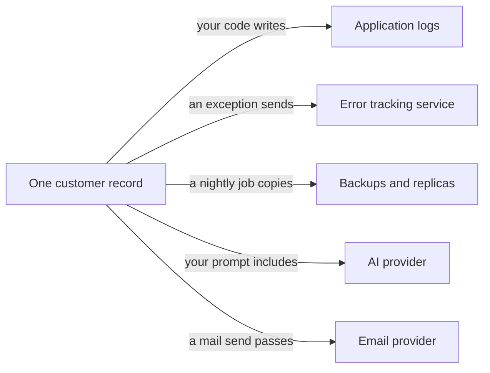
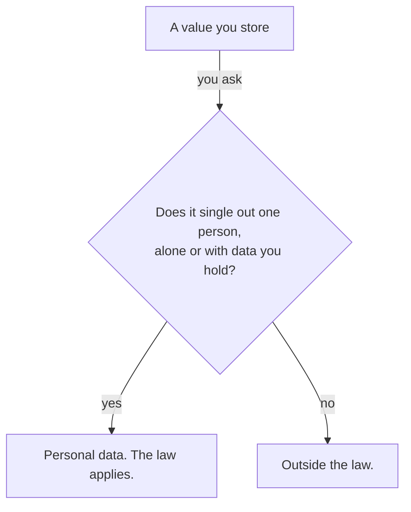

Personal data is any information about a living person you can pick out from everyone
else. You pick the person out directly by a name, or indirectly by an id, an IP
address or a cookie.

Your AI writes the code that stores and sends this data. It cannot tell you which
fields in your app identify a person, or how long the law lets you keep them.

This page covers UK law and nothing else.

{: .rules}
- **NEVER** put a name, an email address or a token in a URL.
- **NEVER** send customer personal data to a consumer AI account.
- **NEVER** publish hashed personal data as anonymous data.
- **ALWAYS** count the 72 hours from when you learned of a breach.

## The problem

One endpoint is missing a permission check. A customer opens a page and sees another
customer's name, address and order history. Nobody stole anything, and the law still
calls this a personal data breach, because unauthorised access to personal data is one
of the forms a breach takes.

You then have 72 hours from the moment you learn of it to report this breach to the
Information Commissioner's Office, the UK regulator for data protection. This site
calls it the ICO from here on. You may skip the report only when the breach is
unlikely to cause risk to the people involved, and this one is not.

Most reported incidents are not attacks. In the last quarter of 2025 UK organisations
reported 3,677 incidents to the ICO, and 77% of them had no cyber element. The most
common single type was an email sent to the wrong recipient, at 17%. Only 64% of
reports arrived inside 72 hours. The figures come from the ICO data security incident
trends dashboard.

## Mental model

You do not hold personal data in one place. One customer record copies itself into
every system that touched it, and each copy is yours to answer for.

Deleting the customer record empties the box on the left. The five copies stay until
you delete each one.

## What counts

The test is whether the value lets you pick one person out of the rest.

A value moves from "Outside the law" to "Personal data" when you add a second table
that joins to it.

- **Direct identifiers.** A name, an email address, a postal address, a phone number.
- **Online identifiers.** A cookie id, a device id, an advertising id given to a phone,
  or a device fingerprint built from the settings a browser reports. The ICO treats
  these as identifiers in their own right.
- **IP addresses.** A dynamic IP address counts as personal data for a website operator
  that has a lawful route to identify the person behind it. The Court of Justice of the
  European Union decided this in the Breyer case in 2016. That decision stayed part of
  UK law after Brexit.
- **Your own ids.** A user id or a username counts once it tells one person from
  another, even with no real name attached to it.
- **Living people only.** The Data Protection Act 2018 limits the law to living
  individuals.

Two kinds carry extra duties. Special category data covers nine subjects:

- racial or ethnic origin
- political opinions
- religious or philosophical beliefs
- trade union membership
- genetic data
- biometric data used to identify one person
- health
- sex life
- sexual orientation

Using any of them needs an extra condition in law, beyond the one that covers an
ordinary field. Criminal offence data has its own separate rule and is not special
category data.

UK law never uses the term PII. Two laws govern this in the UK. The Data Protection
Act 2018 is an Act of Parliament, and the UK GDPR is the European regulation of 2016
kept in UK law and amended since. Both say personal data, and the two phrases do not
cover the same ground. The ICO names this as a common compliance error. A team scopes
its work to the fields that look like personally identifiable information. It then
misses the identifiers that single out a person without naming them.

## Hashing an email address does not anonymise it

The ICO lists three pseudonymisation techniques: hashing, encryption, and tokenisation,
which swaps a value for a lookup code. Pseudonymised data reduces risk and stays inside
the law, because somebody still holds what reverses the replacement.

Three mechanisms defeat a bare hash of an email address:

- **The input space is small.** An attacker hashes a list of likely addresses and
  compares the results. The US Federal Trade Commission stated it plainly in July 2024:
  these sets are small, so they are trivially reversible by guess and check.
- **The value stays linkable.** A bare hash has no salt, which is a random value mixed
  in before hashing. Every system therefore holds the same value for the same person,
  and any two of them can match their rows.
- **You still hold the original.** The plaintext sits in your users table, so you
  reverse the hash by looking it up.

Anonymised data is data that nobody can trace back to a person by any realistic means,
and it falls outside the law. The ICO asks whether a motivated intruder, reasonably
competent and equipped with the internet and public records, could single out a person.
A hashed value with a large and unguessable input space can be anonymous for a
recipient who holds no key. An email address is not such a value.

Publishing a hash as anonymous data therefore discloses personal data. That is a breach
you have to record, and it may be one you have to report.

## Where personal data spreads

- **Application logs.** A logged request or configuration object prints every field
  inside it, including the ones you never chose to record. Log files are read by more
  people than the database is.
- **Error tracking.** An error tracking service sends the variables that were in scope
  when the error happened. The Sentry software development kit for Python does this by
  default, through `include_local_variables`, checked on 2 September 2026. Those
  variables hold whatever the request was processing at the time.
- **URLs.** A query string reaches your server logs, your CDN provider's logs and the
  visitor's browser history. Every analytics script and advertising script on the page
  reads the whole address from the browser as well. Chrome stopped sending the path to
  other websites in 2020 and Firefox in 2021, so the referrer header is no longer the
  main route out.
- **AI prompts.** Everything you place in a prompt reaches the AI provider, and the
  provider's terms decide what happens to it next.
- **Backups and replicas.** A replica is a second copy of the database kept in step
  with the first. Both copy on a schedule and keep the row after you delete it.
- **Search indexes and caches.** Each one stores its own copy of the fields it holds.
- **Audit tables and soft deletes.** An audit table records old values on purpose. A
  soft delete marks the row as gone and leaves it in place. Keeping the old values is
  the point of both.
- **Exports and support tickets.** A CSV file of customer rows travels through email
  and cloud drives, where your permission checks do not run.

## Deleting the row is not the deletion

A person can ask you to erase their data, and you have one month to answer. That
answer has to cover every copy you can reach.

Backups get a separate treatment. The ICO accepts putting backup data beyond use
rather than deleting it at once. You stop using the data for any purpose and let the
backup expire on an established schedule. The schedule has to exist and has to run. A
store of snapshots that nothing ever removes fails the condition, and you must tell the
person what happens to their data in your backups.

You also have to tell the other companies you sent the data to, unless that proves
impossible or takes disproportionate effort. An export committed to Git is harder to
remove, because Git keeps every version of every file and every clone of the repository
holds it.

## The duties stay with you when the data leaves

You decide why and how your users' data is used, which makes you the data controller.
Every duty on this page falls on you. A company that uses that data only as you
instruct is a data processor, and it needs a data processing agreement with you that
sets out what it may do. The role follows the practical reality of who decides, and
not the label in the contract.

AI providers make this concrete. Their business terms and their consumer terms differ
in ways that decide whether you may send customer data at all.

| Service | Position on customer personal data |
|---|---|
| Anthropic commercial terms | No training on customer content. A data processing agreement applies by reference. |
| Anthropic consumer terms, UK | Personal use only. An organisation must use the commercial terms. |
| OpenAI API and business plans | Not used for training by default. A data processing agreement is available. |
| OpenAI consumer ChatGPT | Content may be used to train models. No data processing agreement is offered. |
| Google Gemini API, unpaid tier | Google's terms tell you not to submit personal information. Human reviewers may read it. |
| Google Gemini API, paid tier | Required for any service used by people in the UK. Prompts are not used for improvement. |

A consumer account leaves you with no processing contract at all. Two rows forbid the
use outright. Anthropic's consumer terms are for personal use only, and Google requires
the paid tier for any service used by people in the UK.

Sending personal data out of the UK is its own duty. UK adequacy regulations name the
places you may send it to with no extra paperwork, and they cover most of Europe and a
short list of other countries. A transfer to the United States is covered only when the
recipient holds a current certification under the UK Extension to the EU-US Data Privacy
Framework. Anything else needs the International Data Transfer Agreement, a standard
contract the ICO publishes, plus a risk assessment.

## The duties that change what you build

- **The ICO fee.** £52 a year for a micro organisation, meaning 10 staff or fewer, or
  turnover of £632,000 or less. £78 for small and medium, meaning 250 staff or fewer,
  or turnover of £36 million or less. £3,763 for everybody else. Each is £5 lower by
  direct debit. Almost every company running a web app has to pay. The fee registers
  you and approves nothing you do.
- **Subject access requests.** A subject access request is a person asking for a copy
  of the data you hold about them. You have one month to answer. Complex or repeated
  requests allow two further months. The clock pauses while you ask what the request
  covers. Since June 2025 the search has to be reasonable and proportionate rather than
  exhaustive.
- **Erasure.** One month to answer, across every copy you can reach. Backups go beyond
  use and expire on their own schedule.
- **Complaints.** Since 19 June 2026 you have to give people a route to complain to
  you, acknowledge a complaint within 30 days, and tell them the outcome.
- **Breach reports.** 72 hours to the ICO, counted from when you became aware. Tell the
  people affected when the risk to them is high. Encryption can remove that second duty
  and never removes the first. Record every breach, including the ones you decide not
  to report.
- **Storage limitation and data minimisation.** Collect only what the purpose needs.
  Keep each kind of data only as long as that purpose lasts. The length you choose for
  one kind of data is its retention period.
- **Cookies.** PECR, the Privacy and Electronic Communications Regulations, governs the
  act of storing or reading anything on a visitor's device. The UK GDPR then governs
  the personal data you collect that way. Both apply, and PECR comes first. Consent is
  the default. Since 5 February 2026 one of the new exceptions covers aggregate
  statistics about how the service is used, with clear information and a free way to
  object. Advertising, tracking and profiling still need consent. From the same date a
  PECR breach can cost up to £17,500,000 or 4% of worldwide turnover.
- **Fines.** Up to £8,700,000 or 2% of worldwide turnover for failures of security,
  record keeping and risk assessment. Up to £17,500,000 or 4% for breaking the
  principles or the rights. The higher of the two figures applies, so a small company
  faces the cash amount.

The amounts, dates and regulator guidance above are current at 2 September 2026. The
Data (Use and Access) Act 2025 changed several of them, and the ICO is still revising
its guidance to match. This page names the duties and does not replace advice on your
own situation.

## What you decide

| Decision | Why it is yours |
|---|---|
| Which fields identify a person | Only you know what your other tables join to |
| How long each kind of data is kept | The law sets no number. Your purpose sets it. |
| Which companies may receive it | Only you know what leaves in a prompt, an event or an export |
| Whether an incident is reportable | You judge the risk to the people, inside 72 hours |
| Whether your analytics needs consent | Only you know what the tool records and why |

## Common mistakes

- **Scoping the work to "PII".** The fields that carry no name are the ones that track
  a person across sessions.
- **Calling a hashed email address anonymous.** It is pseudonymised, so every duty
  still applies to it.
- **Logging the whole request.** One line records the fields the rest of the code
  spends its time protecting.
- **Deleting the row and leaving the copies.** Backups, replicas, indexes, audit tables
  and processors all still hold it.
- **Using a consumer AI account for customer data.** You get no processing contract,
  and some terms forbid the use outright.
- **Waiting for certainty before reporting.** The 72 hours runs from awareness, and a
  late report has to carry reasons for the delay.
- **Keeping everything forever.** Every extra row raises what one breach costs and
  widens what a subject access request has to search.

## Next

- [What is a secret]({{ '/foundations/what-is-a-secret' | relative_url }}) — the other class of value that leaks the same way
- Lawful bases, and which one your app actually relies on
- Retention schedules, and how to write one you can honour
