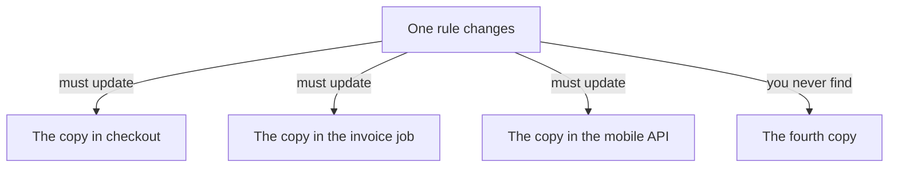

Technical debt is the extra work that every future change costs you, caused by
decisions already taken. The code runs. The bill arrives later, on each change, for as
long as the code lives.

Your AI can produce more code per hour than any person, and debt grows with the amount
of code. It can also produce debt in places you cannot pay it off, which is the part
of this page that matters most.

{: .rules}
- **NEVER** change the meaning of stored data without moving what already exists.
- **NEVER** let code continue after a failure it cannot repair.
- **ALWAYS** find every writer of a value before you change what it means.

## The problem

The first month with a new codebase is fast. The sixth month is slow, and nobody can
point at the change that did it, because no single change did.

Debt is not ugly code. Ugly code inside one function is cheap, because you rewrite the
function and nothing else moves. Debt is how many places must change together, and
how many of those places you can still find.

Three of those you fix. The fourth is now a bug that only appears for some customers,
and nothing in your test run will tell you it is there.

## Why the AI adds debt faster

The failures on the [previous page]({{ '/foundations/how-your-ai-fails' | relative_url }})
each have a cost, and this is where the costs land.

- **It writes a new copy rather than finding yours.** Yours may not be in front of it,
  and a copy always works. Now one rule lives in four places.
- **It makes the smallest edit that satisfies the request.** Forty of those, and the
  structure is the sum of forty local decisions that never met each other.
- **It never says the work needs a different shape.** A person who has changed the
  same file six times starts asking why. The model starts fresh every time.
- **It hides failures to keep the program running.** A swallowed error turns a loud
  problem into a quiet one that produces wrong data instead of stopping.

None of this is carelessness. The model produces what a finished change looks like,
and a finished change looks local.

## Not all debt costs the same

The distinction that matters is not how bad the code looks. It is what has to exist
for you to fix it.

| What is wrong | What fixing it needs | Cost |
|---|---|---|
| Confusing code inside one function | The function | Cheap |
| The same rule copied into four places | Finding all four | Moderate |
| A module that knows too much about another | Changing both, together | Expensive |
| The wrong shape for data already stored | A migration, run while the app is live | Very expensive |
| Wrong values already written to your database | Knowing which rows are wrong | Sometimes impossible |

Everything above the last two rows is code, and code you can rewrite. The last two
rows are data, and data is the debt with no refactor available.

## Data is the debt you cannot refactor

You can replace every line of a program in an afternoon. You cannot replace the
history of what it wrote.

Once a wrong value is stored, three things have usually already happened:

- Other rows were calculated from it.
- Other systems read it, and now hold their own copy.
- Somebody was shown it, in an invoice, an export, or an email.

Now you have to identify which rows are wrong. Often nothing distinguishes a wrong row
from a right one, because both are just numbers. A price stored in pounds where the
column means pence looks like a cheaper order, not like an error.

Three examples, all of which start as a small decision:

- **Money in a floating point number.** Every total is slightly wrong. Six months
  later, no report agrees with any other, and no row is marked as the bad one.
- **Times stored without their zone.** Twice a year an hour repeats. The rows written
  in that hour cannot be put in order afterwards, because the information needed to
  order them was never written down.
- **One column meaning two things.** Somebody used the notes field for a reference
  number. Every later reader must now guess which meaning applies, forever.

**The rule that follows.** Errors that write data are a different category from errors
that display data. A display bug is embarrassing for an hour. A write bug is
permanent, and it is running right now while you read the ticket.

## Changing the shape of data once it is live

Changing a data structure in a running system is the most expensive routine task in
software, and the reason is not the database.

At the moment you deploy, the old code and the new code are both running. Old rows
exist in the old shape. Other systems read the old shape and do not know you changed
anything. A single change that renames a column breaks all three at once.

So the change is made in steps, and each step is safe alone:

```mermaid
flowchart LR
    A["Add the new field"] -- "deploy" --> B["Write both fields"]
    B -- "for every new write" --> C["Copy old values across"]
    C -- "once every row has one" --> D["Read the new field"]
    D -- "once nothing reads the old" --> E["Stop writing the old"]
    E -- "after a safe wait" --> F["Remove the old field"]
```

At no point do the old and new shapes disagree, and at every point you can stop and go
back. The reason to know this exists is not to perform it. It is to recognise that
"just rename the column" is a request with six steps and a week between some of them,
and to say so before your AI does the fast version.

## What you decide

| Decision | Why it is yours |
|---|---|
| Whether a change touches stored data | Only you know what already depends on the old shape |
| Which debt to pay and which to keep | Debt on code you will delete next month is free |
| When a fourth patch should be a rewrite | The model starts fresh each time and cannot notice |
| Whether an error may be swallowed | Only you know if the program can continue truthfully |
| What "wrong" looks like in your data | Nobody else can tell a wrong row from a right one |

## Common mistakes

- **Judging debt by how the code looks.** Cost is how many places move together.
- **Treating a data bug as a code bug.** Fixing the code stops new damage and repairs
  none of the old.
- **Fixing wrong data before fixing the writer.** It fills back in behind you.
- **Renaming a column in one step.** Old code, old rows and other readers all break.
- **Accepting a catch that only logs.** You converted a stopping failure into a silent
  one that writes.
- **Waiting for a rewrite to be worth it.** By then the cost of the rewrite has grown
  with the debt.

## Next

- [Data types]({{ '/foundations/data-types' | relative_url }}) — the choices that become permanent once data exists
- [How your AI fails]({{ '/foundations/how-your-ai-fails' | relative_url }}) — the behaviours that produce this debt
- [Personal data]({{ '/foundations/personal-data' | relative_url }}) — the debt that carries a legal deadline
