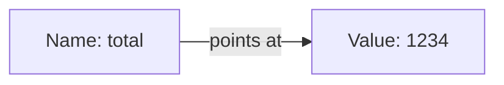
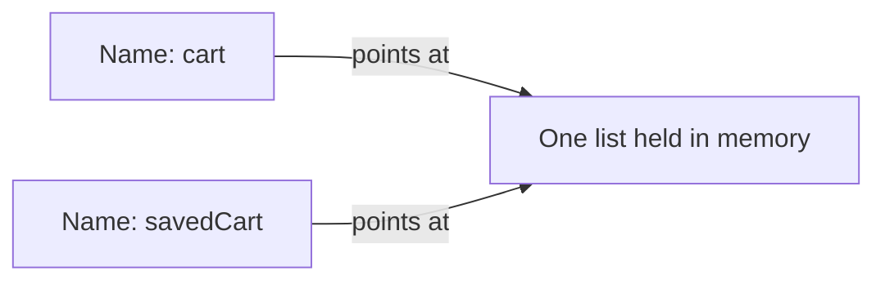

A value is one piece of information, such as `1234`, `Yes` or a customer's name.

A variable is a label attached to one of those values. Your code writes `total`, and
the computer fetches whatever is stored under that label. Almost everything a program
does is reading values, changing them, and putting them somewhere.

{: .rules}
- **NEVER** use one name for two different meanings.
- **NEVER** assume two names hold two separate copies of a value.
- **ALWAYS** name a value for what it means, not for what kind it is.
- **ALWAYS** know where a value came from before you trust it.

## The problem

You ask for a change and the app breaks somewhere unrelated. You edited one thing and
something else moved.

Almost always this is a value question. Two names pointed at one thing, or a name
meant something different from what you assumed, or a value arrived from outside and
was not what it claimed to be.

You cannot judge any of that without knowing what a value is and how a name reaches
it.

## Mental model

A variable is a label on a box. The label is the name. What sits inside is the value.

Your code says `total` and gets `1234`. Change what is in the box and every later line
saying `total` sees the new contents.

The `=` sign is not the `=` from school. It does not say two things are equal. It says
*put this value in this box*, and it happens at that moment, in that order.

## Where values come from

This is the part that decides whether you can trust a value.

| Source | Can you trust it |
|---|---|
| Written in your own code | Yes. You wrote it. |
| Calculated from other values | Only as much as those values |
| Read from your database | Yes, if only your server writes there |
| Typed into a form by a visitor | No. Check it. |
| Part of a web address | No. Anyone can type anything. |
| Sent by another company's service | Only if you verified the sender |

A form is the set of boxes on a page that a visitor fills in and sends to your server.
Everything arriving that way is a claim, not a fact.

## Two names, one thing

This is the single most confusing part for someone new, and it causes bugs that look
impossible.

Simple values, such as a number, are copied when you assign them. Larger things, such
as a list or a record, usually are not. The second name points at the same thing.

Adding an item through `cart` changes what `savedCart` sees, because there is only one
list. Nothing was duplicated. You gave the same thing a second label.

When you need a genuine second copy, you must ask for one.

## Names are the documentation

Six months later the name is often the only explanation left. `d` tells you nothing.
`daysUntilRenewal` tells you the meaning, the unit and the direction.

Two rules earn their keep:

- Name it for what it means, not for its kind. `customerEmail`, not `emailString`.
- Include the unit when there is one. `priceInPence` prevents the mistake that
  `price` invites.

## Constants

Some labels are fixed once and never reattached. Declaring that intention lets the
computer enforce it, and tells the next reader that this one is settled. Reach for it
whenever a number or a piece of text appears in more than one place, or whenever a
bare number would puzzle a reader.

`MAX_UPLOAD_MEGABYTES` explains itself. The number `25` sitting in the middle of a
line does not.

## What you decide

| Decision | Why it is yours |
|---|---|
| What each name means | The computer accepts any name. Only you know the meaning. |
| Whether a value may change after it is set | Only you know if changing it is ever correct |
| Whether you need a copy or a second label | Only you know if the two should move together |
| Which values must be checked on arrival | Only you know which came from outside |

## Common mistakes

- **Reusing a name for a different meaning further down.** The reader now has to
  track which meaning applies where.
- **Names like `data`, `temp`, `result` or `x`.** They describe nothing.
- **Assuming an assignment copies.** For a list or a record it usually does not.
- **Trusting a value because a name sounds official.** `verifiedEmail` is only
  verified if something verified it.
- **Leaving a bare number in the code.** Nobody later knows what it counts.

## Next

- [Data types]({{ '/foundations/data-types' | relative_url }}) — every value has a kind, and the kind decides the behaviour
