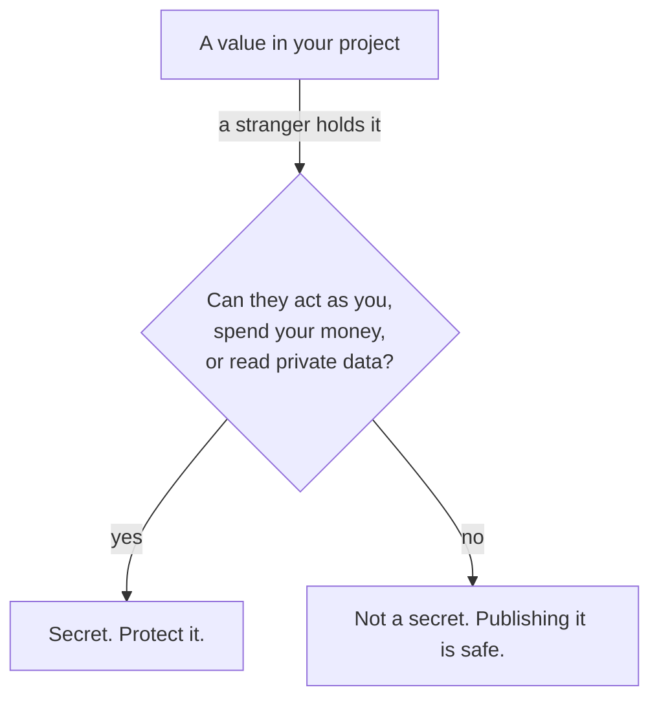
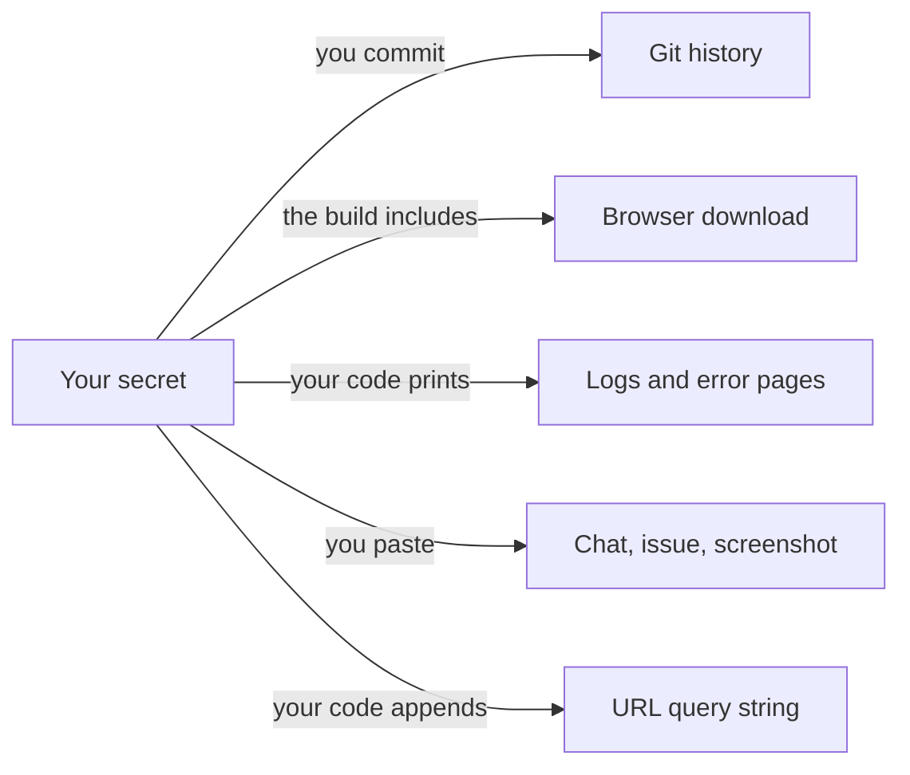

A secret is a value that grants access or proves identity. The system checks the
value, not the person. Anyone who holds it can act as you.

Your AI writes the code that uses secrets. It cannot tell you which values in your
project are secrets, because that depends on what each one unlocks.

{: .rules}
- **NEVER** commit a secret, or place one in code the browser downloads.
- **NEVER** paste a secret into a chat, an issue, a screenshot, or a log.
- **NEVER** put a secret in a URL.
- **ALWAYS** treat a leaked secret as used, and replace it.
- **ALWAYS** use separate keys for development and production.

## The problem

A leaked secret becomes a charge on your card, a copy of your customer table, or an
email sent from your domain.

Automated scanners read every public commit within seconds of the push. A key
published by mistake at 2am is used before you wake. The cost is not theoretical and
the bill is real.

## Mental model

Possession is permission. A secret has no owner and no memory of you. A system that
receives the correct value grants access, and it cannot tell a thief from you.

One question decides whether a value is a secret:

Ask the question about the value, not about the file it sits in. A secret is not
safe because it lives in a file named `.env`.

## What counts as a secret

- **API keys and access tokens.** They act as your account on another company's
  service. Their usage is billed to you.
- **Database credentials.** They open the whole database, not one account.
- **Signing keys.** A session secret or JWT secret lets the holder mint valid logins
  for any user. This is worse than a stolen password, and it leaves no failed login
  attempt behind.
- **Private keys and certificates.** They prove your domain or your identity.
- **Webhook signing secrets.** They let the holder send your server fake events that
  it will trust.
- **Passwords.** Yours, and every password a user gave you.

## The confusing middle

Some values look secret and are published on purpose. Others look harmless and are
not. Guessing wrong in either direction causes harm.

| Value | Safe to publish | Condition |
|---|---|---|
| Stripe publishable key (`pk_`) | Yes | Designed for the browser |
| Stripe secret key (`sk_`) | No | Server only. It moves money. |
| Firebase web config | Yes | Only if security rules are written |
| Supabase anon key | Yes | Only if Row Level Security is enabled |
| Supabase service role key | No | Server only. It ignores every row rule. |
| Any AI provider API key | No | Server only. Its usage is billed to you. |

Read the condition column twice. A publishable key is safe because a second control
does the protecting. Publish the key with that control missing and the key is not
safe. It is an open door.

## Where secrets leak

Each route ends somewhere you do not control and cannot erase.

Two of these surprise people. A value in a URL reaches server logs, browser history
and the referrer header sent to other websites. A logged configuration object prints
every key inside it, and log files are read by more people than the database is.

## Limit the damage before it happens

You cannot prevent every leak. You can decide how much one leak costs.

- **Scope.** A key that reads one table cannot delete your customers. Grant the
  smallest permission that works.
- **Expiry.** A token that expires in an hour is worth little to a thief.
- **Separation.** Separate keys for development and production mean a leaked
  development key touches no real customer.
- **Spending limits.** A hard cap on an AI provider or cloud account turns a stolen
  key from a five-figure bill into a small one.

## What you decide

| Decision | Why it is yours |
|---|---|
| Whether a value is a secret | Only you know what it unlocks |
| How much a key is allowed to do | Least privilege is a design choice, not a default |
| Whether development and production share a key | Convenience now, against how much one leak costs later |
| What happens after a leak | Rotating now costs an hour. Waiting can cost the company. |

## Common mistakes

- **Believing `.env` means safe.** The file helps only when Git ignores it and the
  build excludes it. The name protects nothing.
- **One key for development and production.** Every developer machine now holds
  production access.
- **Pasting a key into an AI chat, an issue, or a support ticket.** You cannot recall it.
- **Trusting a private repository.** Repositories become public, and contractors
  clone them.
- **Publishing a key that needs a second control, with the control missing.** The
  Supabase anon key without Row Level Security exposes the whole database.
- **Deciding to rotate later.** The window between leak and rotation is the attack.

## Next

- [What is Git]({{ '/foundations/what-is-git' | relative_url }}) — why deleting a committed secret does nothing
- [Client and server]({{ '/foundations/client-and-server' | relative_url }}) — which side of the line a secret may cross
- Environment variables and configuration
