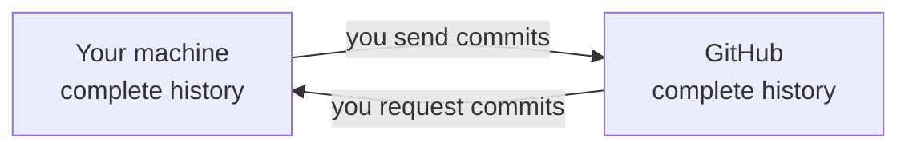
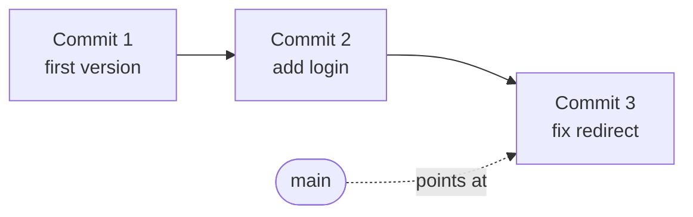
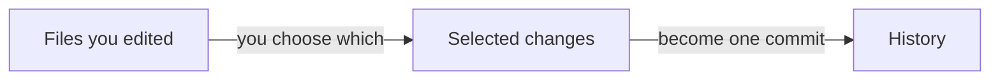
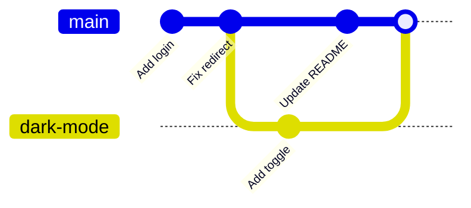

Git records the history of your project. Each checkpoint stores the state of every
tracked file, so you can return to any earlier point.

Your AI runs the commands. You need the model underneath them, because Git is the
one tool that decides whether a mistake costs you five seconds or a week.

{: .rules}
- **NEVER** commit a secret. Environment files, API keys, tokens, certificates.
- **NEVER** commit a database file, user uploads, or anything you cannot recreate.
- **NEVER** force push a branch other people use.
- **ALWAYS** treat a committed secret as public, and replace it.
- **ALWAYS** write a `.gitignore` before the first commit.

## The problem

Without Git you meet these four failures:

- You copy the folder to `project-final`, then `project-final-2`, then `project-final-REAL`.
- You delete code that worked and cannot recover it.
- Two people edit one file, and one edit overwrites the other.
- The app breaks and you cannot tell which change broke it.

Git solves all four. It solves none of them for work you never committed.

## Git is not GitHub

Git is a program on your computer. It works with no internet connection.

GitHub is a website that stores a copy of a Git repository. GitLab, Bitbucket and
Codeberg do the same job.



Both copies hold the whole history. Nothing moves between them until you ask.

You can use Git without GitHub. You cannot use GitHub without Git.

## Mental model

A repository is your project folder plus a hidden `.git` folder inside it. `.git`
holds every checkpoint you ever made. Delete `.git` and the history disappears. Your
current files stay.

A commit is one checkpoint. It holds a snapshot of every tracked file, your message,
the author, the time, and a link to the commit before it.



Each commit links to the one before it. That chain is the history. A branch name is
only a label that points at one commit.

## Why a commit is not a save

Git puts a step between editing and history. You edited 5 files. Only 2 belong to
the bug fix. You choose those 2, and they become one commit. The other 3 wait.



The selection step exists so a commit can mean one thing.

That choice is yours, not the AI's. A commit that means one thing can be reversed on
its own. A commit holding a day of unrelated work cannot.

## Branches

A branch is a label that points at a commit. Creating one costs almost nothing.



Work on `dark-mode` continues while `main` keeps moving. The merge joins them.

Use a branch when the change might fail. Delete the branch and the failure leaves no
trace on `main`.

## Merge conflicts

Two commits change the same lines. Git cannot judge which version is correct, so it
writes both into the file and stops:

```text
<<<<<<< HEAD
your version of the line
=======
their version of the line
>>>>>>> dark-mode
```

Nothing is lost and nothing is broken. Git is asking you a question, because the
answer needs knowledge of what the code is for. Your AI can edit the file. It cannot
know which of two working versions you meant to keep.

## What must never enter the history

Git keeps everything. That is the point of it, and it is also the trap.

**Secrets.** A key committed once stays in the history forever. A later commit that
deletes the file does not remove it. Anyone who clones the repository reads it, and
the history is copied to every machine that ever cloned it. Deleting the file is not
enough. Replace the key.

**Data you cannot recreate.** A database file, user uploads, or customer exports.
Two problems follow. The repository grows and never shrinks, because every version of
every large file is kept forever. Worse, private data now sits on every clone, and
you cannot recall it.

**Generated output.** Dependency folders and build output are not harmful, only
wasteful. Your machine recreates them. Committing them makes every change hard to read.

The `.gitignore` file lists what Git must not track. Write it before the first
commit, because a rule added later does nothing about what the history already holds.

## The one action Git cannot undo

Git protects you from almost every mistake. A commit you abandoned is still
recoverable weeks later. A file you deleted returns.

Two things escape that protection:

- **Work you never committed.** Git has no record of it. Nothing to recover.
- **History you rewrote and pushed to a shared branch.** A force push replaces the
  remote history with yours. Commits other people pushed disappear from it, and their
  next attempt to sync reports a conflict they did not cause.

Everything else is a bad afternoon. These two are lost work.

## What you decide

Your AI handles the mechanics. These four calls stay with you:

| Decision | Why it is yours |
|---|---|
| What one commit contains | Only you know which changes belong to one idea |
| What the message says | In six months the message is the only explanation left |
| Whether to rewrite shared history | A force push deletes commits other people made |
| What never gets committed | The AI cannot tell a secret from a config value |

## Common mistakes

- **Messages like "update", "fix", "asdf".** In six months they tell you nothing.
- **One commit at the end of the day.** You cannot reverse one part of it.
- **Committing a secrets file.** The key is now public. Replace it.
- **Force pushing a shared branch.** It deletes commits other people pushed.
- **Waiting until the work is finished.** Uncommitted work has no history to recover.

## Next

- [What is a secret]({{ '/foundations/what-is-a-secret' | relative_url }}) — why a committed key is already public
- What is a pull request
- Branching for one person and for a team
- What is recoverable, and what is not
